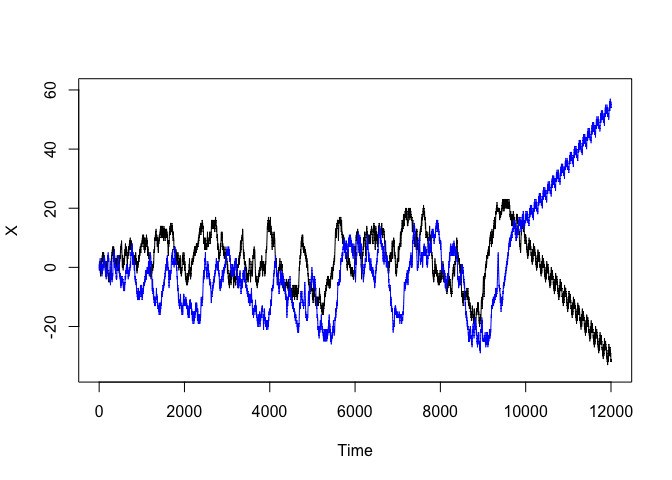
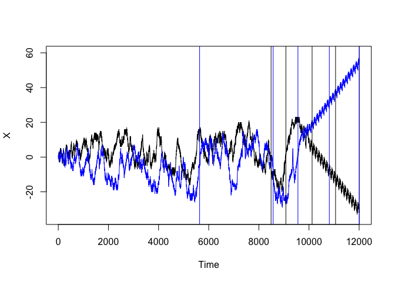
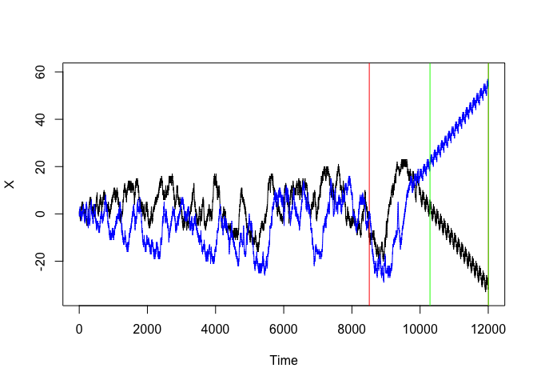
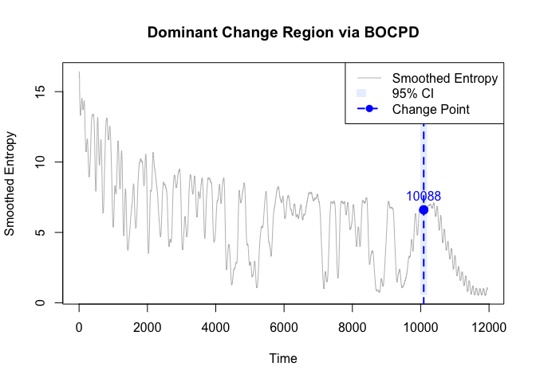
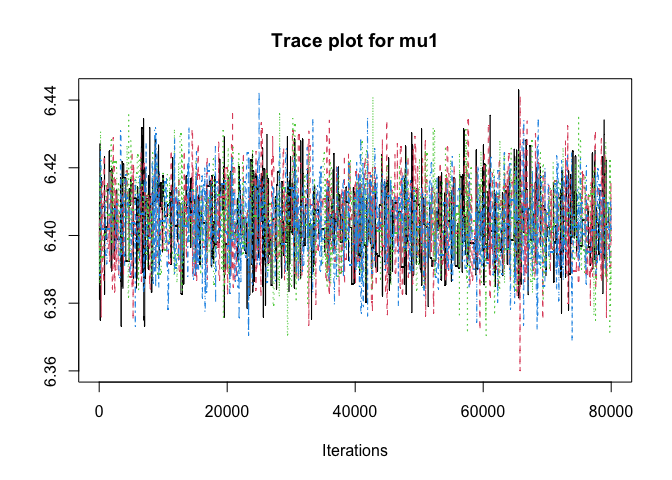
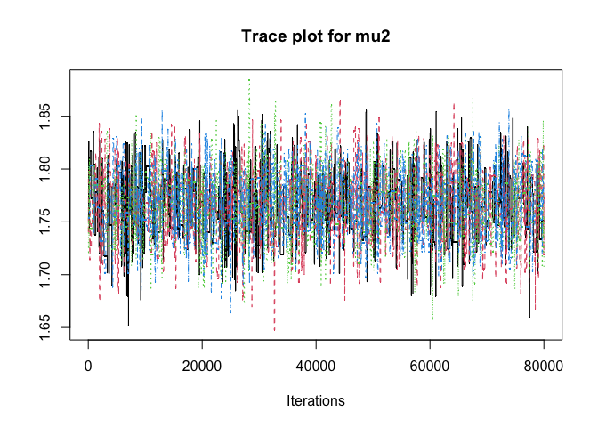
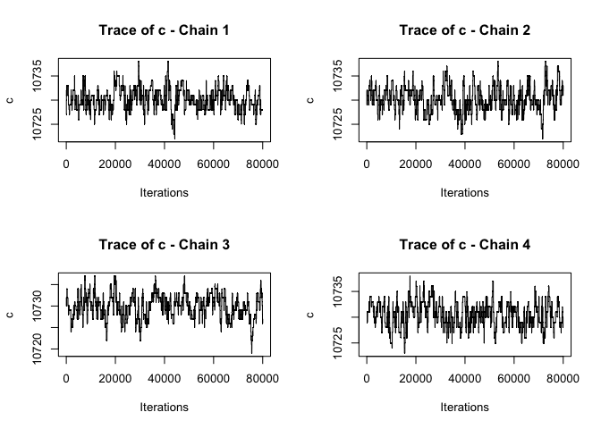
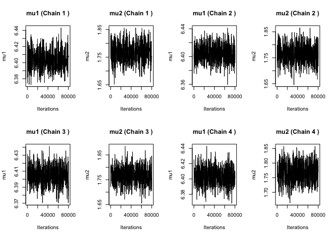

EWS Final Versionn
================
Bohan Zhu
2025-07-05

a

``` r
library(here)
```

    ## here() starts at /Users/macbook/Desktop/U of R/Change_Point_Detection

``` r
load(here("Data/Patches.RData"))
load(here("Data/Ants.RData"))
```

b

``` r
# Make a data frame with tick, ant_x, ant_y, and the grid of pcolor. This
#  will be quite large, and so will slow things down unless (a) you work
#  in package::data.table format, (b) you use multiple cores (e.g., parallel
#  processing) and/or (c) are clever about management. Also, note that
#  a lot of the field was not used:
range(patches_df$X)                         # [1] -33  23
```

    ## [1] -33  23

``` r
range(patches_df$Y)                         # [1] -29  57
```

    ## [1] -29  57

``` r
# Hence, one does NOT need a gridsize of 161 x 161, but rather a grid of
#  [-35,25] x [-30,60] (where I put in some buffer so we can draw nicer
#  looking graphs). This is 61 * 91, which is only about a fifth of the
#  original grid. Still, after 12005 ticks, this will be almost 67 million
#  rows in long data format.
```

c

``` r
plot(ants_df$X,
     ylim = c(-35,60),
     type = 'l',
     xlab = "Time",
     ylab = "X")
lines(ants_df$Y,
     col = "blue")
```

<!-- --> \#
Changepoints

First, find the classical changepoints with mean and variance

by mean

``` r
library(changepoint)                        # Find classical changepoints
```

    ## Loading required package: zoo

    ## 
    ## Attaching package: 'zoo'

    ## The following objects are masked from 'package:base':
    ## 
    ##     as.Date, as.Date.numeric

    ## Successfully loaded changepoint package version 2.3
    ##  WARNING: From v.2.3 the default method in cpt.* functions has changed from AMOC to PELT.
    ##  See NEWS for details of all changes.

``` r
cpt.mean(ants_df$Y)                         # Find changepoints in means
```

    ## Class 'cpt' : Changepoint Object
    ##        ~~   : S4 class containing 12 slots with names
    ##               cpttype date version data.set method test.stat pen.type pen.value minseglen cpts ncpts.max param.est 
    ## 
    ## Created on  : Sat Oct 18 22:31:49 2025 
    ## 
    ## summary(.)  :
    ## ----------
    ## Created Using changepoint version 2.3 
    ## Changepoint type      : Change in mean 
    ## Method of analysis    : PELT 
    ## Test Statistic  : Normal 
    ## Type of penalty       : MBIC with value, 28.17924 
    ## Minimum Segment Length : 1 
    ## Maximum no. of cpts   : Inf 
    ## Number of changepoints: 330

``` r
cpt.mean(ants_df$X)
```

    ## Class 'cpt' : Changepoint Object
    ##        ~~   : S4 class containing 12 slots with names
    ##               cpttype date version data.set method test.stat pen.type pen.value minseglen cpts ncpts.max param.est 
    ## 
    ## Created on  : Sat Oct 18 22:31:49 2025 
    ## 
    ## summary(.)  :
    ## ----------
    ## Created Using changepoint version 2.3 
    ## Changepoint type      : Change in mean 
    ## Method of analysis    : PELT 
    ## Test Statistic  : Normal 
    ## Type of penalty       : MBIC with value, 28.17924 
    ## Minimum Segment Length : 1 
    ## Maximum no. of cpts   : Inf 
    ## Number of changepoints: 306

``` r
plot(ants_df$X,                             # Plot as above
     ylim = c(-35,60),
     type = 'l',
     xlab = "Time",
     ylab = "X")
lines(ants_df$Y,
     col = "blue")
abline(v = cpt.mean(ants_df$X,
                    method = "SegNeigh",
                    penalty = "AIC")@cpts,        # Draw vertical lines at cpts
       col = "black")
```

    ## Warning in cpt.mean(ants_df$X, method = "SegNeigh", penalty = "AIC"): SegNeigh
    ## is computationally slow, use PELT instead

    ## Warning in segneigh.mean.norm(c(1, 1, 0, 0, 1, 1, 2, 2, 1, 1, 0, 0, 1, 1, : The
    ## number of segments identified is Q, it is advised to increase Q to make sure
    ## changepoints have not been missed.

``` r
abline(v = cpt.mean(ants_df$Y,
                    method = "SegNeigh",
                    penalty = "AIC")@cpts, 
       col = "blue")
```

    ## Warning in cpt.mean(ants_df$Y, method = "SegNeigh", penalty = "AIC"): SegNeigh
    ## is computationally slow, use PELT instead

    ## Warning in segneigh.mean.norm(c(0, -1, -1, 0, 0, 1, 1, 0, 0, 1, 1, 2, 2, : The
    ## number of segments identified is Q, it is advised to increase Q to make sure
    ## changepoints have not been missed.

<!-- -->

by variance

``` r
# X var changepoint
var_cpt_X <- cpt.var(ants_df$X, method = "AMOC", penalty = "AIC")
plot(ants_df$X, 
     ylim = c(-35,60), 
     type = 'l', 
     xlab = "Time", 
     ylab = "X")
abline(v = var_cpt_X@cpts, col = "red")

# Y var changepoint
var_cpt_Y <- cpt.var(ants_df$Y, method = "AMOC", penalty = "AIC")
lines(ants_df$Y, col = "blue")
abline(v = var_cpt_Y@cpts, col = "green")
```

<!-- -->

entropy calculation

``` r
library(zoo)
# 1. Define the online entropy calculation function
ent_calc <- function(x, win_sz, time_steps) {
  entropy_x <- vector(mode = "numeric", length = time_steps)
  
  for(index in 1:time_steps) {
    # Online probabilities
    prob_online <- table(x[1:(index+win_sz)]) / (index+win_sz)
    
    # Calculate entropy
    entropy_x[index] <- -sum(prob_online[as.character(x[index:(index + win_sz)])] *
      log(prob_online[as.character(x[index:(index + win_sz)])]))
  }
  return(entropy_x)
}

win_sz <- 50
time_steps <- nrow(ants_df) - win_sz
entropy_X <- ent_calc(ants_df$X, win_sz, time_steps)
```

## BOCPD

``` r
library(Rcpp)

cppFunction('
NumericVector bocpd(NumericVector x, double hazard) {
  int n = x.size();
  NumericVector prob(n, 0.0);
  double mean_est = x[0];
  double variance_est = 1.0;
  prob[0] = 1.0;

  for (int i = 1; i < n; i++) {
    double likelihood = exp(-pow(x[i] - mean_est, 2) / (2 * variance_est));
    double prior = (1 - hazard) * prob[i - 1] + hazard;
    prob[i] = likelihood * prior;
    
    mean_est = (mean_est * i + x[i]) / (i + 1);
  }
  
  return prob;
}')
```

Final Method

``` r
# --- Smoothed entropy ---
entropy_X_smooth <- rollmean(entropy_X, k = 30, fill = NA)
entropy_X_smooth[is.na(entropy_X_smooth)] <- entropy_X[is.na(entropy_X_smooth)]
# --- Run BOCPD ---
hazard_rate <- 0.01
posterior_probs <- bocpd(entropy_X_smooth, hazard_rate)
# --- Sliding window scan ---
window_size <- 200
window_sums <- sapply(1:(length(posterior_probs) - window_size + 1), function(i) {
  sum(posterior_probs[i:(i + window_size - 1)], na.rm = TRUE)
})
best_window_start <- which.max(window_sums)
best_window_end <- best_window_start + window_size - 1
final_cp <- round((best_window_start + best_window_end) / 2)
# --- 95% Confidence interval ---
window_probs <- posterior_probs[best_window_start:best_window_end]
window_index <- best_window_start:best_window_end
window_probs[is.na(window_probs)] <- 0
window_probs <- window_probs / sum(window_probs)

sorted_probs <- sort(window_probs, decreasing = TRUE)
cum_probs <- cumsum(sorted_probs)
included <- sorted_probs[cum_probs <= 0.95]
threshold <- min(included)
ci_index <- window_index[window_probs >= threshold]
ci_start <- min(ci_index)
ci_end <- max(ci_index)
# --- Output ---
cat("Dominant change point at index:", final_cp, "\n")
```

    ## Dominant change point at index: 10088

``` r
cat("Approx. 95% confidence interval: [", ci_start, ",", ci_end, "]\n")
```

    ## Approx. 95% confidence interval: [ 9989 , 10188 ]

``` r
# --- Plot ---
plot(entropy_X_smooth, type = "l", col = "gray", 
     main = "Dominant Change Region via BOCPD",
     xlab = "Time", ylab = "Smoothed Entropy")
polygon(c(ci_start, ci_end, ci_end, ci_start),
        rep(range(entropy_X_smooth, na.rm = TRUE), each = 2),
        col = rgb(0.7, 0.8, 1, 0.3), border = NA)
abline(v = final_cp, col = "blue", lty = 2, lwd = 2)
points(final_cp, entropy_X_smooth[final_cp], col = "blue", pch = 19, cex = 1.5)
text(final_cp, entropy_X_smooth[final_cp] + 1, labels = final_cp, col = "blue", cex = 1)

legend("topright",
       legend = c("Smoothed Entropy", "95% CI", "Change Point"),
       col = c("gray", rgb(0.7, 0.8, 1, 0.3), "blue"),
       lty = c(1, NA, 2),
       pch = c(NA, NA, 19),
       lwd = c(1, NA, 2),
       fill = c(NA, rgb(0.7, 0.8, 1, 0.3), NA),
       border = c(NA, NA, NA))
```

<!-- -->

## MCMC Sampling

``` r
mu1_start <- mean(entropy_X_smooth[1:10088])
mu2_start <- mean(entropy_X_smooth[10089:length(entropy_X_smooth)])
mu1_start
```

    ## [1] 6.416503

``` r
mu2_start
```

    ## [1] 3.292309

1

``` r
# Step 1: MCMC function
mh3d <- function(theta.init, n.iter, x, prop.var) {
  theta.t <- theta.init
  samples <- matrix(NA, nrow = n.iter, ncol = 3)
  accept <- rep(0, n.iter)
  for (t in 1:n.iter) {
    # --- Propose new c with reflective boundary ---
    c.cont <- theta.t[1] + runif(1, -3, 3)
    c.new <- round(c.cont)
    if (c.new <= 5) c.new <- 5 + abs(c.new - 5)
    if (c.new >= (length(x) - 5)) c.new <- (length(x) - 5) - abs(c.new - (length(x) - 5))
    # --- Propose new mu1 and mu2 ---
    mu1.new <- theta.t[2] + rnorm(1, 0, sqrt(prop.var[2]))
    mu2.new <- theta.t[3] + rnorm(1, 0, sqrt(prop.var[3]))
    theta.new <- c(c.new, mu1.new, mu2.new)
    # --- Log posterior using x only ---
    log.post <- function(theta) {
      c <- theta[1]
      mu1 <- theta[2]
      mu2 <- theta[3]
      x1 <- x[1:c]
      x2 <- x[(c + 1):length(x)]

      log.lik <- sum(dnorm(x1, mean = mu1, sd = 1, log = TRUE)) +
                 sum(dnorm(x2, mean = mu2, sd = 1, log = TRUE))

      penalty <- dnorm(mu1, mean = 7, sd = 1.5, log = TRUE) +
                 dnorm(mu2, mean = 3, sd = 1, log = TRUE)

      return(log.lik + penalty)
    }
    log.alpha <- log.post(theta.new) - log.post(theta.t)
    alpha <- exp(log.alpha)

    if (runif(1) < alpha) {
      theta.t <- theta.new
      accept[t] <- 1
    }
    samples[t, ] <- theta.t
  }
  return(list(samples = samples, accept = accept))
}
```

2 initial value

``` r
# Step 2: Run 4 chains
n.iter <- 100000
prop.var <- c(10, 0.05, 0.05)

result1 <- mh3d(theta.init = c(9970, 5.7, 2.7), n.iter = n.iter,
                x = entropy_X_smooth, prop.var = prop.var)
result2 <- mh3d(theta.init = c(9990, 6.0, 2.9), n.iter = n.iter, 
                x = entropy_X_smooth, prop.var = prop.var)
result3 <- mh3d(theta.init = c(10010, 6.3, 3.1), n.iter = n.iter, 
                x = entropy_X_smooth, prop.var = prop.var)
result4 <- mh3d(theta.init = c(10030, 6.6, 3.3), n.iter = n.iter, 
                x = entropy_X_smooth, prop.var = prop.var)

result1_b <- result1$samples
result2_b <- result2$samples
result3_b <- result3$samples
result4_b <- result4$samples
```

3 Trace plot

``` r
library(coda)

burn <- 20000

mcmc_all_mu1 <- mcmc.list(
  mcmc(result1_b[(burn + 1):nrow(result1_b), 2]),
  mcmc(result2_b[(burn + 1):nrow(result2_b), 2]),
  mcmc(result3_b[(burn + 1):nrow(result3_b), 2]),
  mcmc(result4_b[(burn + 1):nrow(result4_b), 2])
)

mcmc_all_mu2 <- mcmc.list(
  mcmc(result1_b[(burn + 1):nrow(result1_b), 3]),
  mcmc(result2_b[(burn + 1):nrow(result2_b), 3]),
  mcmc(result3_b[(burn + 1):nrow(result3_b), 3]),
  mcmc(result4_b[(burn + 1):nrow(result4_b), 3])
)

traceplot(mcmc_all_mu1, main = "Trace plot for mu1")
```

<!-- -->

``` r
traceplot(mcmc_all_mu2, main = "Trace plot for mu2")
```

<!-- -->

``` r
par(mfrow = c(2, 2))

chain_list <- list(result1_b, result2_b, result3_b, result4_b)

for (i in 1:4) {
  chain_data <- chain_list[[i]]
  c_values <- chain_data[, 1]  
  plot(
    c_values[(burn + 1):length(c_values)],
    type = "l",
    xlab = "Iterations",
    ylab = "c",
    main = paste("Trace of c - Chain", i)
  )
}
```

<!-- -->

``` r
par(mfrow = c(2, 4))  

for (i in 1:4) {
  chain_data <- get(paste0("result", i, "_b"))
  
  plot(chain_data[(burn + 1):nrow(chain_data), 2], type = "l",
       main = paste("mu1 (Chain", i, ")"),
       xlab = "Iterations", ylab = "mu1")
  
  plot(chain_data[(burn + 1):nrow(chain_data), 3], type = "l",
       main = paste("mu2 (Chain", i, ")"),
       xlab = "Iterations", ylab = "mu2")
}
```

<!-- -->

4.  Gelman-Rubin diagnostic

``` r
colnames(result1_b) <- c("c", "mu1", "mu2")
colnames(result2_b) <- c("c", "mu1", "mu2")
colnames(result3_b) <- c("c", "mu1", "mu2")
colnames(result4_b) <- c("c", "mu1", "mu2")

mcmc_all <- mcmc.list(
  mcmc(result1_b),
  mcmc(result2_b),
  mcmc(result3_b),
  mcmc(result4_b)
)
gelman.diag(mcmc_all, multivariate = TRUE)
```

    ## Potential scale reduction factors:
    ## 
    ##     Point est. Upper C.I.
    ## c         1.01       1.01
    ## mu1       1.01       1.02
    ## mu2       1.00       1.01
    ## 
    ## Multivariate psrf
    ## 
    ## 1.01

5.  Raftery-Lewis

``` r
library(coda)

param_cols <- c(1, 2, 3)  # c, mu1, mu2

chains <- list(result1_b, result2_b, result3_b, result4_b)
chain_names <- paste0("Chain ", 1:4)

for (i in 1:4) {
  cat("\n========================\n")
  cat("Raftery Diagnostic -", chain_names[i], "\n")
  cat("========================\n")
  print(raftery.diag(as.mcmc(chains[[i]][, param_cols]))$resmatrix)
}
```

    ## 
    ## ========================
    ## Raftery Diagnostic - Chain 1 
    ## ========================
    ##        M       N Nmin      I
    ## c   8507 4746915 3746 1270.0
    ## mu1  209  229456 3746   61.3
    ## mu2  344  387693 3746  103.0
    ## 
    ## ========================
    ## Raftery Diagnostic - Chain 2 
    ## ========================
    ##         M      N Nmin      I
    ## c   17273  17273 3746   4.61
    ## mu1   192 207168 3746  55.30
    ## mu2   417 465109 3746 124.00
    ## 
    ## ========================
    ## Raftery Diagnostic - Chain 3 
    ## ========================
    ##         M      N Nmin      I
    ## c   17384  17384 3746   4.64
    ## mu1   222 268199 3746  71.60
    ## mu2   339 391552 3746 105.00
    ## 
    ## ========================
    ## Raftery Diagnostic - Chain 4 
    ## ========================
    ##         M      N Nmin      I
    ## c   17273  17273 3746   4.61
    ## mu1   212 230739 3746  61.60
    ## mu2   396 431392 3746 115.00

In our changepoint model, the large Raftery-Lewis diagnostic value is
mainly due to strong autocorrelation between samples. Since the
changepoint is a discrete parameter with a naturally low acceptance
rate, the Markov chain tends to stay at the same value for many
iterations. This stickiness leads to high correlation between
consecutive samples, increasing the number of effective samples needed
to estimate the target quantile accurately. As a result, the
Raftery-Lewis statistic becomes large, which is expected and reasonable
in changepoint detection problems.

6 Posterior result

``` r
library(knitr)
all_c   <- c(result1_b[, 1], result2_b[, 1], result3_b[, 1], result4_b[, 1])
all_mu1 <- c(result1_b[, 2], result2_b[, 2], result3_b[, 2], result4_b[, 2])
all_mu2 <- c(result1_b[, 3], result2_b[, 3], result3_b[, 3], result4_b[, 3])

mean_c   <- mean(all_c)
mean_mu1 <- mean(all_mu1)
mean_mu2 <- mean(all_mu2)

ci_c    <- quantile(all_c, probs = c(0.025, 0.975))
ci_mu1  <- quantile(all_mu1, probs = c(0.025, 0.975))
ci_mu2  <- quantile(all_mu2, probs = c(0.025, 0.975))

results_final <- rbind(
  c(mean_c, ci_c),
  c(mean_mu1, ci_mu1),
  c(mean_mu2, ci_mu2)
)

colnames(results_final) <- c("Mean", "Lower Bound", "Upper Bound")
rownames(results_final) <- c("$c$", "$\\mu_1$", "$\\mu_2$")

knitr::kable(results_final, digits = 2)
```

|         |     Mean | Lower Bound | Upper Bound |
|:--------|---------:|------------:|------------:|
| $c$     | 10685.08 |    10123.00 |    10735.00 |
| $\mu_1$ |     6.41 |        6.38 |        6.44 |
| $\mu_2$ |     1.87 |        1.71 |        3.22 |
